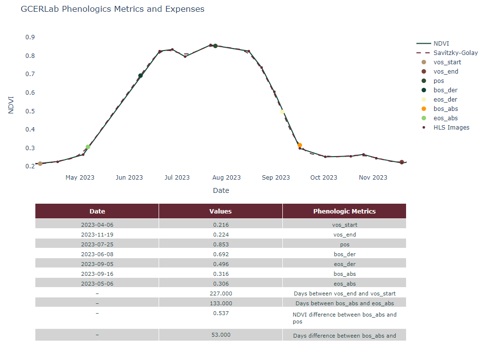
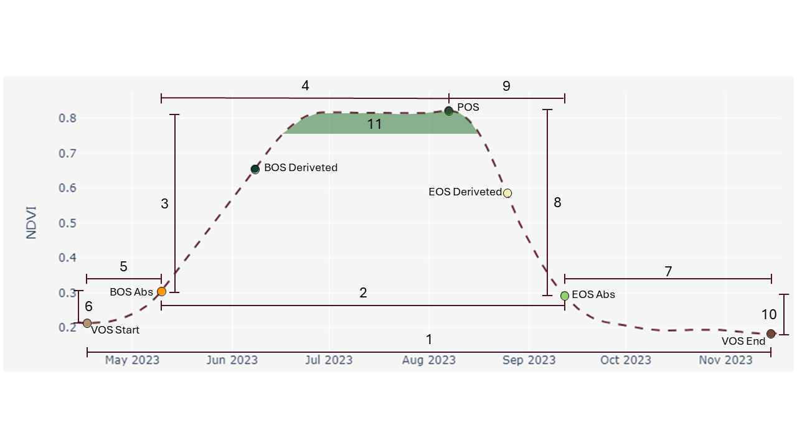
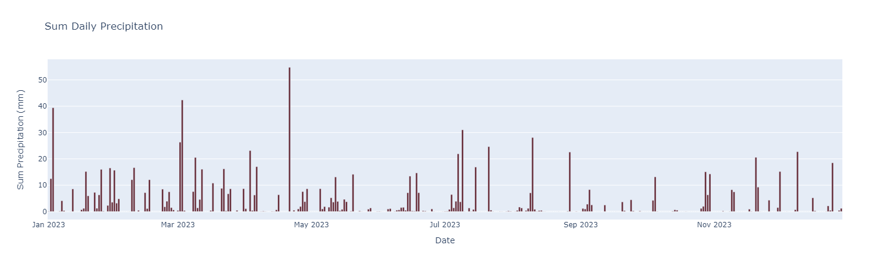
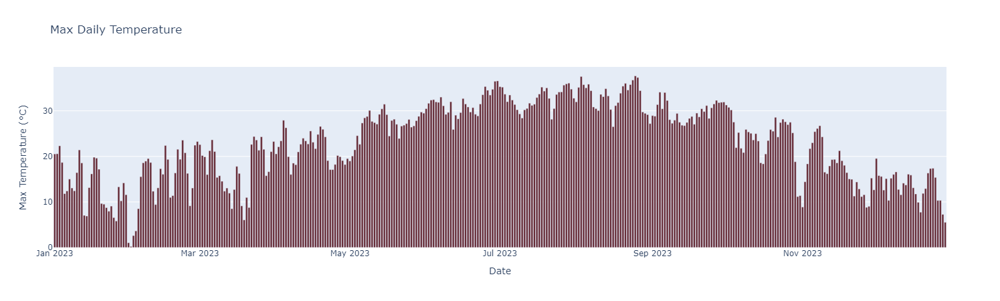
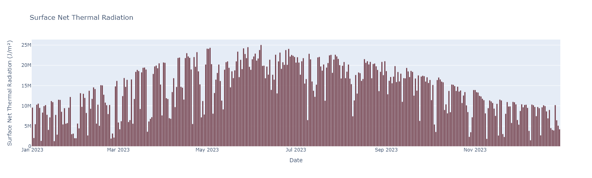

# NDVI Phenologic Metrics Analysis Toolkit

## Overview

This repository contains a suite of Python tools for processing and analyzing Normalized Difference Vegetation Index (NDVI) data, particularly focusing on phenology—the study of cyclic and seasonal natural phenomena. Our toolkit allows users to process geographical data, analyze NDVI metrics from satellite imagery, and visualize these metrics to understand vegetation patterns over time.

## Getting Started

### Prerequisites

- Python 3.x
- Jupyter Notebook
- Required Python libraries: `pandas`, `geopandas`, `scipy`, `plotly`, `earthengine-api`

### Installation

1. Clone the repository:
   ```bash
   git clone [https://github.com/andersonBudziak/msu_timeseries_ndvi.git]
   ```
2. Navigate to the cloned directory and install the required Python packages:
   ```bash
   pip install -r requirements.txt
   ```

## Usage

### Running the Code in a Jupyter Notebook

1. Open your Jupyter Notebook environment.
2. Import the necessary modules from the toolkit:
   ```python
   from src.controllers_v2.time_series_hls import HLS
   from src.controllers_v2.plotter import PhenologyVisualizer
   from src.controllers_v2.metrics_vos_pos import VosPosMetrics
   from src.controllers_v2.metrics_bos_eso import BosEosMetrics
   from src.controllers_v2.geometry import ProcessadorGeoDataFrame
   from scipy.signal import savgol_filter
   ```
3. Set up the analysis by defining your input data and parameters.
4. Execute the code blocks to process and analyze the NDVI data.

Example:
```python
# Initialize the GeoDataFrame processor with a file path
processador = ProcessadorGeoDataFrame('path/to/your/file.gpkg')

# Extract vertices and geometry for a polygon index
vertices, geometry = processador.extract_coordinates(polygon_index)

# Process HLS data
hsl = HLS(geometry, 'start_date', 'end_date')
ndvi_df = hsl.convert_to_dataframe()

# Apply Savitzky-Golay filter to smooth the NDVI data
ndvi_df['savitzky_golay'] = savgol_filter(ndvi_df['ndvi'], window_length, polynomial_order)

# Perform VOS and POS analysis
vos_pos_analyzer = VosPosMetrics(ndvi_df, ndvi_order)
phenology_df = vos_pos_analyzer.analyze_phenology()

# Perform BOS and EOS analysis
bos_eos_analyzer = BosEosMetrics(ndvi_df, phenology_df, threshold_value)
phenology_df = bos_eos_analyzer.execute_analysis()

# Visualize the phenology data
visualizer = PhenologyVisualizer(ndvi_df, phenology_df)
visualizer.convert_dates()
visualizer.create_plot()
```

### Understanding NDVI Metrics

NDVI is a standardized index that allows you to generate an image showing the relative biomass of an area. It is particularly useful in phenology to track plant health, vegetation cover, and seasonal changes.

- **VOS (Start of Season)** and **POS (Peak of Season)** metrics help identify the onset and peak of vegetation growth.
- **BOS (Beginning of Season)** and **EOS (End of Season)** metrics are derived to indicate the start and end of the active growth period.
- The toolkit applies the Savitzky-Golay filter to smooth the NDVI time series data, enhancing the accuracy of metric identification.

This analysis is pivotal in understanding vegetation dynamics, aiding in ecological research, agricultural planning, and environmental monitoring.




### Understanding NDVI Geometrics Metrics
- 1 - Days between vos_start and vos_end
- 2 - Days between bos_abs and eos_abs
- 3 - Vertical difference between bos_abs and pos
- 4 - Horizontal difference between bos_abs and pos
- 5 - Horizontal difference between vos_start and bos_abs
- 6 - Vertical difference between vos_start and bos_abs
- 7 - Horizontal difference between vos_end and eos_abs
- 8 - Vertical difference between eos_abs and pos
- 9 - Horizontal difference between eos_abs and pos
- 10 - Vertical difference between eos_abs and vos_end
- 11 - Days over 85% percentiles NDVI between bos_abs and eos_abs




# Environmental Data Visualization

This repository contains visualizations of key environmental parameters for a specific region. The data covers daily records throughout the year 2023 and includes:

1. **Sum Daily Precipitation**
2. **Max Daily Temperature**
3. **Surface Net Thermal Radiation**

### Sum Daily Precipitation


- **Description:** This plot displays the sum of daily precipitation in millimeters. It highlights the variability in daily rainfall, with significant peaks indicating days with substantial precipitation. The graph provides a clear visualization of rainy and dry periods over the year.

### Max Daily Temperature


- **Description:** This plot shows the maximum daily temperature in degrees Celsius. The data reveals seasonal temperature variations, with higher temperatures during the summer months and lower temperatures during the winter months. The plot helps in understanding the temperature trends and extremes experienced throughout the year.

### Surface Net Thermal Radiation


- **Description:** This plot illustrates the surface net thermal radiation measured in joules per square meter. It represents the amount of thermal energy radiated from the surface, which can be influenced by factors such as solar radiation and surface characteristics. The graph shows the daily fluctuations and seasonal trends in thermal radiation.

### Usage
- These visualizations can be used for environmental analysis, agricultural planning, and climate studies.
- Researchers and analysts can derive insights into precipitation patterns, temperature extremes, and energy balance from the surface.

### Acknowledgments
- Data Source: [Specify the data source if available]
- Visualization created using [mention any tools or libraries used, e.g., Matplotlib, Seaborn, Plotly].

Feel free to explore the visualizations and use them for your analysis.

## License

This project is licensed under the [GCERLab License](https://www.gcerlab.com/).
